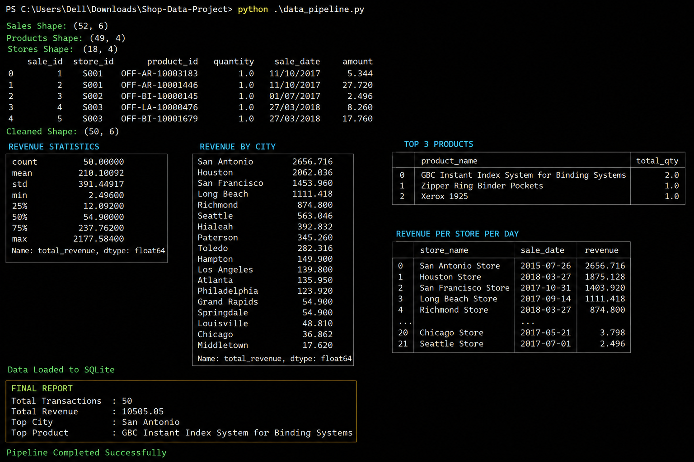

# Shop Data Project (Retail ETL Pipeline)

## 📌 Overview
This is an end-to-end data engineering project that processes retail sales data using Python.  
It performs data cleaning, transformation, analysis, and generates business insights.

---

## ⚙️ Features
- Load data from multiple CSV files (Sales, Products, Stores)
- Data cleaning (missing values, duplicates, date formatting)
- Data merging and transformation
- Revenue calculation and analysis
- City-wise and product-wise insights
- SQLite database storage
- SQL-based reporting

---

## 📊 Key Insights
- Total Transactions
- Total Revenue
- Top Selling City
- Top Selling Product
- Revenue by City
- Store-wise daily revenue

---

## 🛠️ Tech Stack
- Python
- Pandas
- NumPy
- SQLite3

---
## 📊 Output Screenshot



## 🚀 How to Run
```bash
python data_pipeline.py
